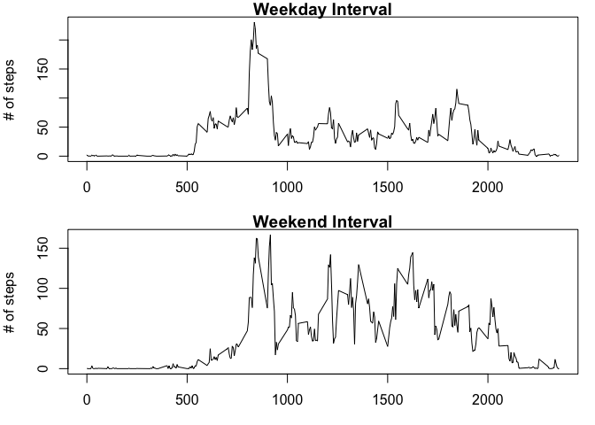

## Loading and preprocessing the data

```r
monitoring_data <- read.csv("activity.csv")
monitoring_data$date <- as.Date(monitoring_data$date, format = "%Y-%m-%d")
```


## What is mean total number of steps taken per day?

```r
monitoring_data2 <- subset(monitoring_data, monitoring_data$steps != 'NA')
daily_total_steps <- tapply(monitoring_data2$steps, monitoring_data2$date, sum)
hist(daily_total_steps, col = "blue", xlab = "Total Daily Steps")
```

<!-- -->

```r
steps_summary <- summary(daily_total_steps)
print(steps_summary[3:4])
```

```
##   Median     Mean 
## 10765.00 10766.19
```


## What is the average daily activity pattern?

```r
Interval_Average <- tapply(monitoring_data$steps, monitoring_data$interval, mean, na.rm = TRUE)
Interval <- unique(monitoring_data$interval)
interval_average_df <- as.data.frame(cbind(Interval, Interval_Average))
with(interval_average_df, plot(Interval, Interval_Average, type = "l", xlab = "Time Interval (in 5 min chunks)", ylab = "Average Steps"))
```

<!-- -->

```r
print(interval_average_df[interval_average_df$Interval_Average == max(interval_average_df$Interval_Average), ])
```

```
##     Interval Interval_Average
## 835      835         206.1698
```


## Imputing missing values using the rounded mean value for the daily interval in question

```r
Total_NAs <- sum(as.numeric(is.na(monitoring_data$steps)))
print(c("Total NA Values = ", Total_NAs), quote = FALSE)
```

```
## [1] Total NA Values =  2304
```

```r
monitoring_data3 <- monitoring_data
monitoring_data$intervalmean <- rep(Interval_Average[1:288], 61)
for (n in 1:17568) {
    if (is.na(monitoring_data3$steps[n]) == TRUE) {
        monitoring_data3$steps[n] <- round(monitoring_data$intervalmean[n])
    }
}
imputed_daily_total_steps <- tapply(monitoring_data3$steps, monitoring_data3$date, sum)
hist(imputed_daily_total_steps, col = "cornflowerblue", xlab = "Imputed Total Daily Steps")
```

<!-- -->

```r
imputed_steps_summary <- summary(imputed_daily_total_steps)
print(imputed_steps_summary[3:4])
```

```
##   Median     Mean 
## 10762.00 10765.64
```

```r
print(steps_summary[3:4])
```

```
##   Median     Mean 
## 10765.00 10766.19
```

```r
print("Substituting daily interval averages to impute missing values slightly lowers the median and mean", quote = FALSE)
```

```
## [1] Substituting daily interval averages to impute missing values slightly lowers the median and mean
```


## Are there differences in activity patterns between weekdays and weekends?

```r
monitoring_data3$day <- weekdays(monitoring_data3$date)
day_names <- unique(monitoring_data3$day)
monitoring_data3$day_type <- monitoring_data3$day
for (n in 1:17568) {
    day_type_test <- as.numeric(monitoring_data3$day[n] == day_names[1:5])
    if (sum(day_type_test) > 0) {
        monitoring_data3$day_type[n] <- "Weekday"
    }
    else {
        monitoring_data3$day_type[n] <- "Weekend"
    }
}
weekday_data <- monitoring_data3[monitoring_data3$day_type == "Weekday", ]
weekend_data <- monitoring_data3[monitoring_data3$day_type == "Weekend", ]
Weekday_Interval_Average <- tapply(weekday_data$steps, weekday_data$interval, mean)
Weekend_Interval_Average <- tapply(weekend_data$steps, weekend_data$interval, mean)
par(mfrow = c(2, 1), mar = c(3, 4, 1, 1), oma = c(0, 0, 0, 0))
plot(Interval, Weekday_Interval_Average, type = "l", ylab = "# of steps", main = "Weekday Interval")
plot(Interval, Weekend_Interval_Average, type = "l", ylab = "# of steps", main = "Weekend Interval")
```

<!-- -->

